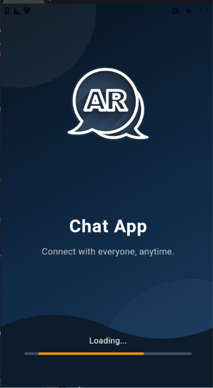
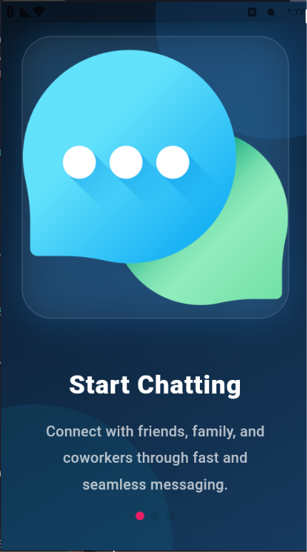
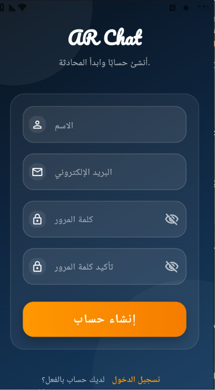
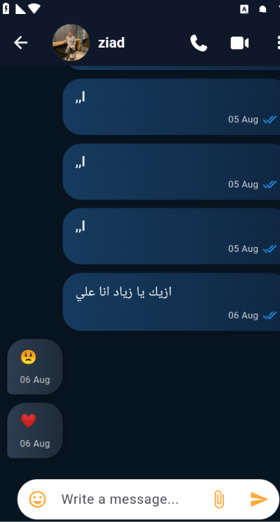

# 💬 ARChat

> A modern real-time messaging application built with Flutter, Firebase, and Node.js, featuring private and group conversations, stories, media sharing, message status, notifications, user profiles, and a dedicated notification backend.

---
<p align="center">
  
</p>

<h1 align="center">💬 ARChat</h1>

<p align="center">
  A modern real-time messaging application built with Flutter, Firebase, and Node.js.
</p>


---
---

## 🎥 App Demo

<p align="center">
  <a href="PUT_YOUR_GITHUB_VIDEO_LINK_HERE">
    ▶️ <strong>Recording_edited_splash_2s.mp4</strong>
  </a>
</p>

<p align="center">
  A quick walkthrough of ARChat's main features and user experience.
</p>

---
## 📸 Screenshots

### 🔐 Authentication

## 📸 Screenshots

### 🚀 Splash



### 👋 Onboarding

| Onboarding 1 | Onboarding 2 | Onboarding 3 |
|--------------|--------------|--------------|
|  |  |  |

### 🔐 Authentication

| Login | Register |
|-------|----------|
|  |  |
### 🏠 Home & Chat

| Home | Chat View | 
| ---- | --------- | 
|  |  | 

### 📸 Updates

| Updates | Add Update | 
| ------- | ---------- | 
|  |  | 

### 👥 Contacts

| Contacts | Contact Profile |
| -------- | --------------- |
|  |  |
---

# ✨ Features

## 🔐 Authentication

* User registration and login
* Firebase Authentication
* Email verification
* Forgot password
* Authentication state management
* Secure user authentication flow

---

## 💬 Real-Time Messaging

* One-to-one conversations
* Real-time messaging with Cloud Firestore
* Sent / Delivered / Seen message status
* Message timestamps
* Reply to messages
* Save messages
* Emoji picker
* Image sharing
* File sharing
* Message notifications
* Chat user information
* Conversation management

---

## 👥 Group Conversations

* Create groups
* Add multiple members
* Group profile image
* Group information
* Group administrators
* Group messaging
* Group member management

---

## 📸 Updates / Stories

* Create image and video updates
* View users' updates
* Story viewer tracking
* Seen / Unseen indicators
* Story viewers
* Like and reply to updates
* Media-based updates

---

## 📢 Broadcast

* Broadcast updates to multiple users
* Dedicated broadcast interface
* Media support
* User interaction with broadcasts

---

## 📞 Calling

* Dedicated calling interface
* Call view
* Calling-related UI and navigation

> Calling functionality is structured as part of the application and can be extended with a real-time calling provider.

---

## 🔔 Notifications

ARChat includes a dedicated notification system with a separate Node.js server.

### Notification Server

The notification backend is built with:

* Node.js
* Express.js
* Firebase Admin SDK
* Firebase Cloud Messaging
* Firestore listeners

The server is responsible for processing messaging events and sending notifications to users.

---

## 👤 User Profiles

* User profile
* Profile image
* User information
* Edit profile
* User profile viewer
* Online status
* Profile settings

---

## ⚙️ Settings & User Experience

* Dark modern UI
* Language settings
* Privacy settings
* Help and support screen
* Storage management
* Notification settings
* Responsive Flutter interface
* Reusable custom widgets
* Loading states
* Error handling
* Smooth navigation

---

# 🛠️ Tech Stack

## 📱 Mobile Application

* **Flutter**
* **Dart**
* **Flutter BLoC / Cubit**

## 🔥 Firebase

* **Firebase Core**
* **Firebase Authentication**
* **Cloud Firestore**
* **Firebase Storage**
* **Firebase Cloud Messaging**

## 🖥️ Backend

* **Node.js**
* **Express.js**
* **Firebase Admin SDK**
* **HTTP APIs**
* **Firestore**

## 📦 Packages

### State Management

* `flutter_bloc`

### Firebase

* `firebase_core`
* `firebase_auth`
* `cloud_firestore`
* `firebase_storage`
* `firebase_messaging`

### UI & UX

* `font_awesome_flutter`
* `smooth_page_indicator`
* `emoji_picker_flutter`
* `cupertino_icons`

### Media & Files

* `image_picker`
* `file_picker`
* `video_player`
* `open_filex`

### Utilities

* `shared_preferences`
* `intl`
* `http`
* `flutter_local_notifications`

---

# 🏗️ Project Architecture

ARChat follows a structured Flutter architecture with separated application logic, services, models, views, and reusable widgets.

```text
ARChat/
│
├── android/
├── ios/
├── web/
│
├── lib/
│   │
│   ├── cubit/
│   │   ├── auth/
│   │   ├── chat/
│   │   ├── profile/
│   │   └── updates/
│   │
│   ├── models/
│   │
│   ├── services/
│   │
│   ├── view/
│   │   ├── auth/
│   │   ├── chat/
│   │   ├── groups/
│   │   ├── profile/
│   │   ├── updates/
│   │   └── settings/
│   │
│   ├── widgets/
│   │   ├── chat/
│   │   ├── groups/
│   │   ├── updates/
│   │   └── profile/
│   │
│   └── main.dart
│
├── archat-notification-server/
│   ├── server.js
│   ├── package.json
│   └── ...
│
├── pubspec.yaml
└── README.md
```

---

# 📂 Main Views & Screens

The application contains a wide range of screens and reusable components, including:

* Splash View
* Onboarding View
* Login View
* Register View
* Home View
* Chat View
* Chat Bubble
* Chat Bubble Window
* Contacts
* Groups
* Call View
* Profile View
* User Profile
* Edit Profile
* Settings
* Language
* Privacy
* Help
* Notifications
* Storage
* Save Message
* Updates
* Add Update
* Update View
* Viewer View
* Broadcast

---

# 🔥 Firebase Integration

ARChat uses Firebase as the primary cloud infrastructure for the application.

### Firebase Authentication

Handles:

* User registration
* Login
* Email verification
* Password recovery
* Authentication state

### Cloud Firestore

Stores and synchronizes:

* Users
* Conversations
* Messages
* Groups
* Updates
* Story viewers
* Message status
* User interactions

### Firebase Storage

Used for:

* Profile images
* Chat images
* Videos
* Uploaded files
* Story media

### Firebase Cloud Messaging

Used for application notifications and messaging-related events.

---

# 🖥️ Notification Backend

ARChat includes a dedicated Node.js notification server.

```text
Flutter App
     │
     │
     ▼
Firebase / Firestore
     │
     │
     ▼
Notification Server
     │
     │
     ▼
Firebase Cloud Messaging
     │
     ▼
User Device
```

The backend is separated from the Flutter application to handle server-side notification logic.

---

# 🚀 Getting Started

## 1. Clone the repository

```bash
git clone https://github.com/aa8273-commits/ARChat.git
```

## 2. Open the project

```bash
cd ARChat
```

## 3. Install Flutter dependencies

```bash
flutter pub get
```

## 4. Configure Firebase

Connect the application to your Firebase project and add the required Firebase configuration files.

## 5. Run the Flutter application

```bash
flutter run
```

---

# 🖥️ Running the Notification Server

Navigate to the notification server:

```bash
cd archat-notification-server
```

Install Node.js dependencies:

```bash
npm install
```

Configure the required environment variables in your local `.env` file.

Then run:

```bash
node server.js
```

> Environment variables and private credentials should never be committed to GitHub.

---

# 🎯 Project Goals

ARChat was built to practice and demonstrate:

* Flutter application development
* Firebase integration
* Node.js backend development
* Real-time communication
* Firestore data modeling
* State management with Cubit
* Authentication flows
* Push notification architecture
* Media handling
* File management
* Group communication
* Story / update systems
* Reusable UI components
* Backend and mobile application integration
* Building a complete real-world messaging application

---

# 🔮 Future Improvements

* Advanced voice and video calling
* Message reactions
* Message editing and deletion
* Advanced group administration
* Improved media compression
* More notification customization
* Advanced privacy controls
* Additional chat customization options

---

# 👨‍💻 Developer

**Abdulrahman Ahmed**

Flutter Developer focused on building modern, scalable mobile applications with Flutter, Firebase, and backend technologies.

### Connect with me

* 💼 LinkedIn: [Abdulrahman Ahmed](https://www.linkedin.com/in/abdulrahman-ahmed-ibrahim-400151360)
* 🐙 GitHub: [aa8273-commits](https://github.com/aa8273-commits/ARChat.git)

### Project

* 🔗 [ARChat on GitHub](https://github.com/aa8273-commits/ARChat.git)

---

## ⭐ Support

If you find ARChat useful or interesting, consider giving the repository a ⭐.


